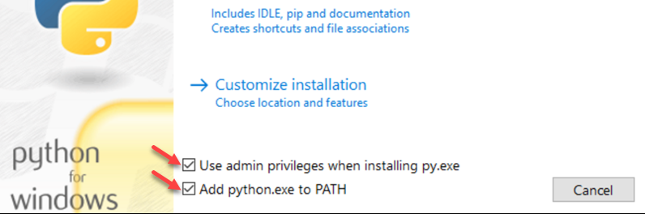

# TikTok Collector
A Python script that automates the downloading of a given public collection.

> **DISCLOSURE:** This tool exists primarily so content creators who want to gather all THEIR OWN content into an organized folder. Since TikTok does not provide a meaningful way for users to retrieve their videos like other social platforms this tool visits the collection url to download the content and tag it with the same title, username, and likes count.
> This code in this repo heavily leans into preexisting scraping library that can already scrape every popular social platform.
>
> **USE AT YOUR OWN RISK**: It is also worth noting that running scrapers may be against Terms of Service (ToS) even though TikTok may no longer exist sometime in the future. The existence of this code repository doesn't directly violate any ToS but running this tool against their endpoints would directly violate their ToS.
>
> If TikTok provides a reasonable way for content creators to download their videos or ends up sticking around beyond 2025-01-19, I am willing to remove this repo.


## Prerequisites
* Python 3 / PIP - [Downloads](https://www.python.org/downloads/release/python-3128)
> Scroll to the bottom of the page to **Files** to find the installer for your system.


### Windows Users
For those using "Windows installer", during the installation of Python ensure the two checkboxes at the bottom are ticked for:
 * "Use admin privileges when installing py.exe"
 * Add python.exe to PATH


The "Add python.exe to PATH" is the option that will make `python` and `pip` commands available in your terminal, if you skip these options you will end up getting a **Command Not Found** error for the steps listed below.


Reference Image




## Steps

### 1. Install Dependencies
Assuming you have Python 3 installed and it is available in your PATH.


In your terminal (Powershell, Bash, etc) run the following command:

### Windows Users using Powershell
Copy, paste, and run each line below in order. Each command needs to run separately.

```
python -m venv .venv
```

```
.venv\Scripts\activate
```


```
pip install -r requirements.txt
```

### Linux / Mac Users
Copy, paste, and run each line below in order. Each command needs to run separately.

```
python -m venv .venv
```

```
source .venv/bin/activate
```

```
pip install -r requirements.txt
```


### 2. Configure your settings
First you will need to open up the `settings.cfg` file and fill in the missing values.

COLLECTION_URL must be a publicly available TikTok collection.

```
# REPLACE THE VALUES ON THE RIGHT SIDE OF = with your own.

COLLECTION_URL=https://www.tiktok.com/@someusername/collection/somecollection-99999
COLLECTION_NAME=CollectionNameHere
OUTPUT_PATH=C:\MyTikTokCollection
```

### 3. Extract Video URLS
Once your `settings.cfg` is linked to a public collection. It is now time to extract all the video URLs from that collection into a file so **Step 4** can use it.

Extract the URLs by running the Python script:

`python extract.py`

On successful run of this script it will produce a `yt-dlp` command that you will need for **Step 4**. It should look similar to this.

```
EXAMPLE OUTPUT of running python extract.py
----------------------------------------------

Extracted 11 video URLs. Saved to /media/dev/projects/tiktok/Bookbinding_videos.txt

To scrape videos, copy and paste the following command: 

   yt-dlp -f "bv*+ba/b" -a 'C:\MyTikTokCollection\CollectioNameHere_videos.txt' -o 'C:\MyTikTokCollection\TikTok_%(uploader).50s_%(title).50s_%(like_count)dlikes.%(ext)s'

Note: The above command will download videos to the output path.
```

### 4. Start Scraping Videos

You will need to copy the output you received from running command in **Step 3** it should begin with `yt-dlp` and it will end with `'`.

Paste the contents and run the command to begin the scraping process.

The command you copy and paste to run should look similar to this but will contain your specific paths

Example produced from **Step 3**

```
yt-dlp -f "bv*+ba/b" -a 'C:\MyTikTokCollection\CollectioNameHere_videos.txt' -o 'C:\MyTikTokCollection\TikTok_%(uploader).50s_%(title).50s_%(like_count)dlikes.%(ext)s'
```